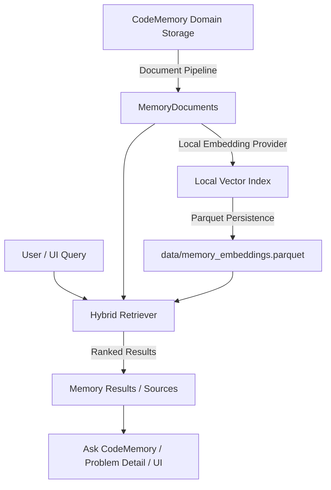

# CodeMemory Phase 7: Semantic Personal Memory & Intelligent Retrieval

CodeMemory Phase 7 transforms CodeMemory from a standard submission log into a **Personal DSA Memory Engine**. It provides unified semantic indexing, hybrid retrieval (structured criteria + keyword match + vector similarity), similar problem recommendations, mistake pattern tracking, and grounded QA.



---

## 1. Unified Memory Model & Provenance

Every record in CodeMemory (problem metadata, attempt reasoning, code submission, mistake log, AI analysis, evolution narrative) is mapped to a unified `MemoryDocument`:

- `memory_id`: Unique identifier (e.g. `prob_123`, `att_456`, `sub_789`, `mistake_101`)
- `memory_type`: Enum (`Problem`, `Attempt`, `Submission`, `Mistake`, `Pattern`, `Note`, `AI Analysis`, `Solution Evolution`)
- `problem_id` & `submission_id`: Primary keys linking back to original storage
- `source` & `source_reference`: Strict provenance tracking mapping to raw DuckDB/Parquet/Markdown files
- `content_hash`: SHA-256 digest of content used for incremental indexing

---

## 2. Local-First Vector Indexing & Incremental Cache

- **Vector Storage**: Persisted locally in `data/memory_embeddings.parquet`.
- **Zero-Dependency Vectorizer**: `LocalEmbeddingProvider` uses L2-normalized 64-dimensional feature hashing over n-grams. Operates 100% locally with zero external API dependencies or heavy ML overhead.
- **Incremental Indexing**: When `index_all()` is executed, unchanged memory documents (`is_indexed(memory_id, content_hash)`) are skipped, ensuring instant indexing without re-embedding unaltered records.

---

## 3. Hybrid Retriever Architecture

The `HybridRetriever` combines three distinct scoring components:

$$\text{Final Score} = w_{\text{sem}} \cdot S_{\text{sem}} + w_{\text{kw}} \cdot S_{\text{kw}} + w_{\text{struct}} \cdot S_{\text{struct}}$$

1. **Semantic Similarity ($S_{\text{sem}}$)**: Cosine similarity between query embedding and memory document vector.
2. **Keyword Relevance ($S_{\text{kw}}$)**: Term-frequency matching over title, content, topics, and patterns (with double title weighting).
3. **Structured Criteria ($S_{\text{struct}}$)**: Matches on difficulty, topic, pattern, status, language, or memory type.

Default weights: $w_{\text{sem}} = 0.5$, $w_{\text{kw}} = 0.3$, $w_{\text{struct}} = 0.2$.

---

## 4. Key Services & Features

### `find_similar_problem(problem_id)`
Recommends related problems based on shared topics, patterns, difficulty, and conceptual vector similarity. Includes human-readable explanations of why the problem is considered similar (e.g. *"Shared topics: Hash Table • Same difficulty (Easy)"*).

### `find_common_mistakes(topic)`
Retrieves historical failure records, TLE performance flaws, and WA edge-case bugs across attempts.

### `find_previous_approaches(problem_id)`
Traces the chronological progression of solution attempts (Attempt 1 Brute Force TLE → Attempt 2 HashMap WA → Attempt 3 Accepted).

---

## 5. CLI Memory Commands

```bash
# Perform incremental indexing over all memory documents
codememory memory index

# Rebuild vector index from scratch
codememory memory rebuild

# Perform hybrid memory search
codememory memory search "sliding window"

# Recommend similar problems to Two Sum
codememory memory similar two-sum

# Show common mistake records
codememory memory mistakes

# Display personal memory statistics
codememory memory stats
```
